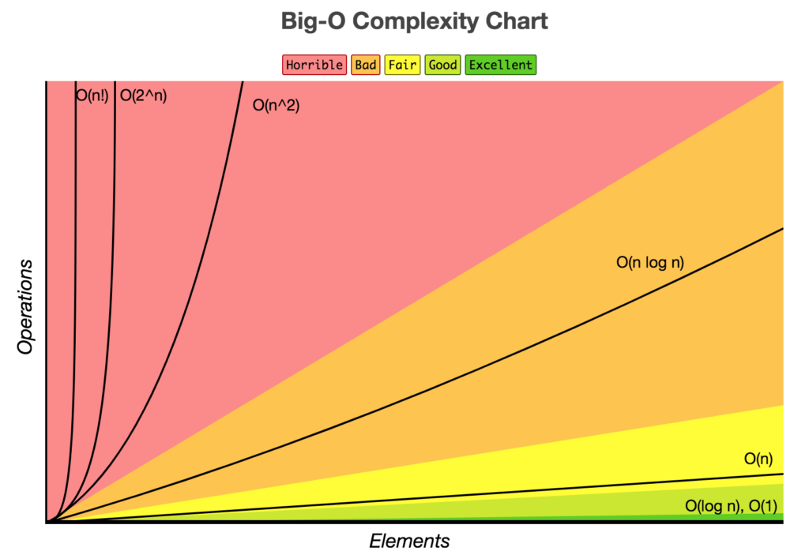
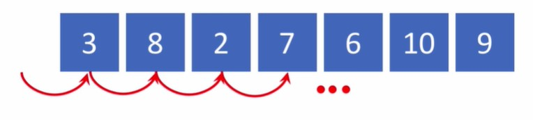
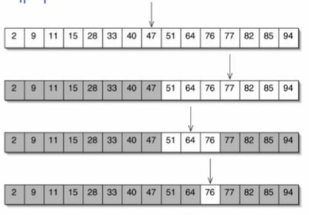
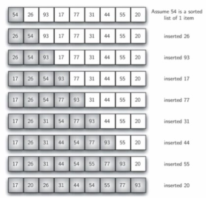

# 6강 : 알고리즘의 복잡도

`알고리즘의 복잡도`는 **문제를 해결하는 데 있어서 얼만큼의 자원을 요구하는가**를 나타낸다.

## 1. 시간 복잡도(Time Complexity)

**입력으로 주어지는 데이터의 크기에 따라 시간이 얼마나 많이 걸리는 지**를 의미한다. 즉, 문제의 크기와 이를 해결하는 데 걸리는 시간 사이의 관계를 의미한다.

<p align="center">
    
    <p align="center">출처 : <a href="http://bigocheatsheet.com/">http://bigocheatsheet.com/</a></p>
</p>

### 1-1. 평균 시간 복잡도(Average Time Complexity)

임의의 입력 패턴을 가정했을 때 소요되는 시간의 평균

### 1-2. 최악 시간 복잡도(Worst-case Time Complexity)

가장 긴 시간을 소요하게 만드는 입력에 따라 소요되는 시간

## 2. 공간 복잡도(Space Complexity)

**문제를 해결하는 데 있어 얼마나 많은 공간을 사용해야 하는가**를 의미한다. 예를 들어, 배열이 담기는 그 자체 메모리, 문제를 풀기 위해 필요한 부가적인 메모리의 공간이 얼만큼 필요한 지를 나타낸다.

## Big-O Notation(빅오 표기법)

점근 표기법(asymptotic notation)의 하나이다.

어떤 함수의 증가 양상을 다른 함수와의 비교로 표현할 때 사용한다. 

흔히 알고리즘 복잡도를 표현할 때 흔히 쓰인다.

$O(log_n)$, $O(n)$, $O(n^2)$, $O(2^n)$ 등으로 표기한다.

입력의 크기가 n일 때,

- $O(log_n)$ : 입력 크기의 로그에 비례하는 시간이 소요된다.
- $O(n)$ : 입력의 크기에 비례하는 시간이 소요된다.

이때, 계수(곱해지는 수)는 크게 중요하지 않은데, n이 무한대로 커지면 기하급수적으로 시간이 소요되기 떄문이다. 예를 들어, $2^n$에서 n이 무한대로 증가하든, $10^n$에서 n이 무한대로 증가하든, 제곱으로 곱해지는 수는 그래프 상으로 가파르게 증가한다.

### 선형 시간 알고리즘 - $O(n)$

n개의 무작위로 나열된 수에서 최댓값을 찾기 위한 `선형 탐색` 알고리즘의 시간 복잡도는 $O(n)$으로 표현할 수 있다.



모든 수를 앞에서부터 비교해나가야 하는데, `최댓값`은 배열의 모든 수를 다 살펴보기 전까지는 알 수 없다. 따라서 평균적으로 걸리는 시간이나 최악의 상황에서 소요되는 시간은 모두 데이터 크기 n에 비례한다.

- Average Case : $O(n)$
- Worst Case : $O(n)$

### 로그 시간 알고리즘 - $O(logn)$

n개의 **크기 순으로 정렬된** 수에서 특정 값을 찾기 위한 `이진 탐색` 알고리즘은 $O(logn)$으로 표현할 수 있다.



선형 시간 알고리즘보다는 이 알고리즘이 훨씬 낮은 복잡도를 가진다.

예를 들어, log의 밑이 2라고 가정하면 다음과 같이 정리할 수 있다.

<table>
    <tr>
        <th>알고리즘</th>
        <th>n</th>
        <th>값</th>
        <th>차이</th>
    </tr>
    <tr>
        <td rowspan="2">log<sub>2</sub>n</td>
        <td>2</td>
        <td>1</td>
        <td rowspan="2">7</td>
    </tr>
    <tr>
        <td>64</td>
        <td>8</td>
    </tr>
    <tr>
        <td rowspan="2">2<sup>n</sup></td>
        <td>2</td>
        <td>4</td>
        <td rowspan="2">60</td>
    </tr>
    <tr>
        <td>6</td>
        <td>64</td>
    </tr>
</table>

log는 n이 8배가 증가해도 7만큼만 증가하는 반면, 지수 알고리즘은 n이 3배만 증가해도 차이가 60이나 난다.

따라서 $O(logn)$의 복잡도를 가진 알고리즘은 효율이 좋은 알고리즘이라고 말할 수 있다.

### 이차 시간 알고리즘 - $O(n^2)$

n의 크기에 비례해서 지수적으로 시간 복잡도가 증가하는데, 최악의 경우에는 제곱한 값만큼 증가하는 복잡도를 가질 수 있다. 대표적으로 `삽입 정렬(Insertion Sort)`이 이에 해당한다.



- Best Case : $O(n)$ 
  - 주어진 배열이 이미 순서대로 배열되어 있다면, 한번도 삽입을 수행하지 않고 끝난다. n개의 수만 살펴보고 끝나므로 n에 비례하는 복잡도를 가진다.
- Worst Case : $O(n^2)$
  - 만약, 역순으로 정렬되어 있다면 하나의 원소를 적당한 위치에 삽입하기 위해 이미 정렬된 원소들을 뒤로 한 칸씩 밀어야 한다. 그래서 정확하게는 $O(n^2/2)$ 이지만, Big O Notation에서는 계수는 중요하지 않으므로 $O(n^2)$로 표현한다.

### 보다 낮은 복잡도를 가지는 정렬 알고리즘 - $O(nlogn)$

입력 패턴에 따라 정렬 속도에 차이가 존재하나, 정렬 문제에 대해서 $O(nlogn)$보다 낮은 복잡도를 갖는 알고리즘은 존재할 수 없다는 것이 이미 증명되어 있다.

대표적으로 `병합 정렬(Merge Sort)`가 존재한다.

.jpg)

우선 데이터를 절반씩 나누어서 정렬을 하는데 $log_2n$만큼 시간이 소요되고, 시간 복잡도는 $O(logn)$이 된다.

.jpg)

하나의 원소로만 구성된 배열은 이미 정렬이 되어있는 것 간주하고, 두 개의 묶음을 하나로 합쳐서 큰 값은 뒤로, 작은 값은 앞으로 보내면 길이 2짜리 정렬된 배열이 완성된다. 길이가 2인 배열을 두 묶음으로 같은 과정으로 묶으면 길이가 4인 배열이 완성된다.

마지막으로 합쳐진 배열에서는 앞에서부터 순서대로 정렬을 해나가면 되므로 시간 복잡도는 $O(n)$이 된다.

.jpg)

따라서 최종적으로 $O(nlogn)$의 복잡도를 가지게 된다.

### 꽤 복잡한 문제

`배낭 문제(Knapsack Problem)`
- 배낭에는 15kg의 물건만 담을 수 있다.
- 각각의 물건들은 서로 다른 무게와 가치를 가지고 있다. 
- 이때, 어떤 것들을 골라서 담아야 최대의 가치를 낼 수 있는가를 구하는 문제이다.

최악의 경우에는 모든 물건들을 다 담았다가 빼보는 $O(2^n)$의 복잡도가 발생할 수 있다. 여기서는 다루지 않겠지만 `동적 프로그래밍(Dynamic Programming)`으로 효율적으로 해결할 수 있는 문제이다.

`경영과학`에서도 다루는 내용이기도 하지만, 이렇게 프로그래밍에서 만나다니 반갑기도 하다.

## 연습문제

### 객관식 4.

> N 개의 수가 입력으로 주어진다고 할 때, 모든 원소들 사이의 대소 관계를 비교하여 N X N 행렬로 나타내고자 합니다. 이 문제를 풀기 위하여 모든 원소의 쌍에 대하여 대소 관계를 비교하여 그것을 행렬에 채우는 방법을 택한다고 할 때, 이 알고리즘의 복잡도를 big-O 점근 표기법으로 표기한 다음 중 알맞은 것을 선택하세요.

``` python
for i in range(N) :
    for j in range(N) : 
        # 계산식
```

여기서는 이차원 행렬로 표현이 되기 때문에, 이중 반복문을 수행하면서 행렬을 채워나가야 할 것이다. 따라서 시간 복잡도는 $O(N^2)$이다.

### 객관식 5.

> N 행 N 열의 정사각행렬 A 와 B 가 주어진다고 할 때, 이 두 행렬의 곱 (product) 인 N X N 행렬 C 를 계산하기 위하여 다음과 같은 방법을 쓸 수 있습니다.

``` Python
for i in range(N):
    for j in range(N):
        C[i][j] = 0
        for k in range(N):
            C[i][j] += A[i][k] * B[k][j]
```

> 이러한 알고리즘을 이용하여 행렬의 곱셈을 행할 때, 이 행렬 곱셈 (matrix multiplicaiton) 알고리즘의 복잡도를 big-O 점근 표기법으로 알맞게 표기한 것을 아래 보기에서 선택하세요.

4번과 비슷하게 여기서는 반복문을 3번 사용하므로 시간 복잡도는 $O(N^3)$이다.

