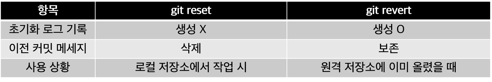
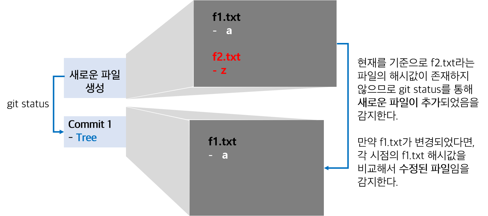

# Git

Git을 공부하며 모르는 것, 새로 배운 것들을 위주로 정리한 문서입니다.

## 1. 생활코딩 - Git

강의 링크
- [생활코딩-지옥에서 온 Git](https://opentutorials.org/course/2780)

## Git 소개

Git은 `Version Control System`의 한 종류이다. 파일의 버전을 관리하기 위한 시스템은 파일의 이름을 바꾸지 않고도 파일 내부의 내용을 변경할 수 있도록 도와준다. 

### Version Control System

#### 종류

버전 관리 시스템은 여러 종류가 있는데, 대표적으로 `CVS`, `SVN`, `GIT`이 있다. 현재 `CVS`는 자주 쓰이지 않으며, `SVN`을 대체하기 위해 나타난 것이 `GIT`이라 생각하면 된다. 그럼에도 `SVN`은 현업에서 여전히 많이 쓰이고 있는 시스템이다.

한편, 버전 관리 시스템은 개발자만의 전유물은 아니다. `Google Drive`나 `Dropbox`와 같은 클라우드 서비스도 이에 해당한다. 물론 개발자가 사용하는 버전 관리와는 결이 다르지만, 본질적으로는 `파일을 쉽게 관리할 수 있다`는 것이다.

#### 기능

버전 관리 시스템의 기능으로는 다음과 같이 3가지가 존재한다.

1. Backup(백업) : 파일이 날라갔을 때 최근부터 다시 시작할 수 있도록 도와줌.
2. Recovery(복구) : 이전 상태로 돌아가고 싶을 때 특정 시점으로 돌아갈 수 있도록 도와줌.
3. Collaboration(협업) : 다른 사람과의 개발을 효과적으로 관리하도록 도와줌.

## 주요 명령어

- `ls -al` : 현재 디렉토리에 있는 모든 파일들을 보여준다.
- `pwd` : 현재 어느 디렉토리에 있는지 보여준다.
- `cd 경로` : 이동하고자 하는 경로로 이동한다.
  - ex) `$ cd C:\Users\workspace\github\TIL\Git`
- `mkdir 폴더이름` : 현재 디렉토리에서 입력한 폴더 이름을 생성한다.
- `Ctrl + Insert` : CMD창에서 선택한 영역을 복사한다.
- `Shift + Insert` : 복사한 내용을 붙여넣는다.
- `vim 파일이름.확장자명` : 현재 디렉토리에서 파일을 생성하거나, 해당 파일을 수정한다.
  Ex) `vim hello_git.txt` : `hello_git.txt`파일을 생성한다.
  - `i`(insert) : 위의 명령어를 입력하고 키보드에서 `i`를 누르면 내용 편집이 가능해진다.
  - `esc`(escape) : 현재 작업에서 나온다.
  - `:wq`(write and quit) : 현재 작성한 내용을 저장하고 종료한다.
- `cat 파일이름.확장자명` : 현재 디렉토리에서 파일의 내용을 조회한다.

## git init : 저장소 만들기

`Git`을 로컬 저장소에서 생성하기 위해서 `Git Bash` 프롬프트에서 `git init`을 입력하면 `.git`이라는 파일이 생성된다. 이 파일은 버전에 대한 정보를 담고 있는 파일이며, 평소에는 숨김 파일로 설정되어 눈에 보이지 않는다. 그리고 파일이 추가/삭제 되거나, 파일의 내용이 변경되는 것을 자동으로 감지할 수 있다. 해당 파일을 삭제하면 이전 버전에 대한 정보가 날아가므로 주의해야 한다.

`git init`은 `initialize(초기화)`를 의미한다. 이 명령어를 실행하기 전까지 폴더는 내 컴퓨터에만 존재하는 세상 평범한 폴더였지만, 이제는 버전 관리가 가능한 특별한 폴더가 된다.

참고로 Github의 저장소 구조를 나타내면 아래의 사진과 같다.

<p align='center'>
    
    <p align='center'>출처 : <a href="https://velog.io/@devmin/깃허브github-명령어-알아보기">https://velog.io/@devmin/깃허브github-명령어-알아보기</a></p>
</p>

크게는 `로컬 저장소`와 `원격 저장소` 2가지로 나뉘는데, 쉽게 말해서 `로컬 저장소`은 내 컴퓨터에 저장된 폴더를 의미하고, `원격 저장소`는 `Github` 서버에 올라간 폴더를 의미한다. 

주의할 점은 실시간으로 폴더 내의 변화를 감지해서 원격 저장소와 연동 하는 것이 아니다. 지속적으로 변화하는 파일의 상태를 실시간으로 서버와 지속적으로 연결해서 비교하는 것은 네트워크 자원을 소모하는 낭비일 뿐이며, 파일 버전 관리의 의미가 없어지게 된다. 

~~누가 이렇게 생각을 하겠냐마는, 부끄럽게도 처음에 내가 이렇게 생각했었다.~~

앞으로 자세히 설명하겠지만, `git add` - `git commit` - `git push` 순으로 명령어를 입력하면 Github에 내 파일들이 올라가는 것을 볼 수 있다.


## git add : git이 관리할 대상으로 파일 등록

`git add`는 작업 디렉토리 상의 변경 내용을 스테이징 영역에 추가하기 위해 사용하는 명령어이다. 

예를 들어, `hello.txt`를 해당 폴더에 처음 생성하고 prompt에서 `git status`를 입력하면 파일의 상태를 다음과 같이 확인할 수 있다.


빨간색으로 표시된 파일이 현재 `Untracked` 상태라는 것인데, `git`이 해당 파일에 대한 어떠한 정보도 가지고 있지 못하다는 것을 의미한다. 


명령어가 실행되면 스테이징 영역으로 넘어가서 `Tracked`로 상태가 바뀌고, 초록색으로 표시되는 파일은 현재 커밋을 기다리는 단계임을 알려준다.

### 사용법

1. `git add .` : 현재 디렉토리의 모든 변경 내용을 스테이징 영역으로 넘길 때 `.`을 인자로 넘긴다. 개인적으로 1번을 제일 많이 사용한다.
    
2. `git add -A` : 작업 디렉토리 내의 모든 변경 내용을 모두 스테이징 영역으로 넘긴다. `git add .`와는 달리 현재 디렉토리를 기준으로 상위 폴더의 변경 내용까지 포함한다. 
    ``` TEXT 
    \---one 
      | one.txt
      |
      +---two
      |   two.txt
      |

    ```
    만약, 위와 같이 `one`폴더 아래 `two` 폴더가 있다고 했을때, `one`폴더에서 `three.txt`를 생성하고 `two` 폴더에서 `git add -A`를 실행하면 상위 폴더에서 생성된 `three.txt` 파일도 스테이징 영역으로 넘긴다.

3. `git add 파일/디렉토리 경로` : 작업 디렉토리의 변경 내용의 일부만 스테이징 영역에 넘기고 싶을 때는 수정한 파일이나 디렉토리의 경로를 인자로 넘긴다.

### git status : 파일의 상태를 조회

이 명령어는 `Untracked`, `Tracked`, `Modified`, `Unmodified` 4가지로 현재 파일의 상태를 나타낸다.


<p align='center'>
    
    <p align='center'>출처 : <a href="https://git-scm.com/">https://git-scm.com/</a></p>
</p>


1. 처음 생성하면 `Untracked` 상태인데, 파일을 `git add`로 스테이징 영역으로 옮기면 `Tracked` 상태가 된다.
2. `commit`을 통해 현재 버전에 대한 이력을 저장했다면, 자동으로 `Unmodified` 상태로 변경이 된다.
3. `commit`이 완료된 파일이 수정된다면 `Modified`로 변경된다.
4. `Modified` 상태의 파일을 다시 `git add`로 스테이징 영역에 올린다. 즉, 한번 커밋된 파일이 수정되면 무조건 다시 `git add`부터 입력해주어야 한다는 것이다.
5. 만약 `commit`이 완료된 파일을 삭제하게 되면 해당 파일은 `Untracked` 상태가 되어 git의 관리 대상에서 제외된다.

### Staging Area

`스테이징 영역`은 커밋을 대기하는 장소로써, 작업 디렉토리와 Git 저장소 변경 이력 사이의 징검다리 역할을 한다. `작업 디렉토리`는 아직 commit할 준비가 안된 변경 내용을 자유롭게 수정할 수 있지만, `스테이징 영역`은 commit할 준비가 된 변경 내용이 Git 저장소에 기록되기 전에 대기하는 장소이다. 그래서 `git add` 명령어를 사용하면 현재 `작업 디렉토리`에 있는 모든 파일 또는 일부 파일의 변경 내용을 `스테이징 영역`으로 옮길 수 있다. 

## git commit : 버전 만들기

`git commit`은 파일 및 폴더의 추가/변경 사항을 저장소에 기록하는 것이다. 즉, 파일(폴더)의 버전이 의미 있는 변화가 발생했다는 것이고, 특정 작업이 완결된 상태로 바뀌었다는 것을 의미한다. 커밋을 할 때는 보통 변경 내역에 대한 상세한 설명을 함께 포함하는데, 이것이 우리가 Github의 레포지토리에서 발견하는 문구이다. 커밋한 내용을 통해 어떤 파일이 언제, 어떻게 변경되었는지 한 눈에 타임라인으로 파악할 수 있다.


### 사용법

1. `git commit -m "메세지 내용"`  : 변경 내역에 대한 메모와 함께 커밋한다.
2. `git commit -am "메세지 내용"` : `git add`와 `git commit`을 동시에 수행한다. 단, 이 기능을 사용하기 위해서는 commit이 한 번은 수행되어 있어야 한다.
3. `git commit --amend` : 방금 커밋한 메세지를 수정한다. 

### git log : 커밋 내역 확인

`git log`를 입력하면 아래와 같이 커밋이 완료된 내역들에 대해 조회할 수 있다. 


#### 사용법 

1. `git log -p` : commit 내역을 한 줄씩 내리면서 확인할 수 있다.
2. `git log diff 커밋코드1..커밋코드2` : 다른 2개의 커밋에 대해서 어떤 파일이 변경되었고, 어떤 코드가 변경되었는지 차이점을 보여준다.


위의 사진에서는 `git log diff 가장 마지막 커밋..가장 최근 커밋`을 입력을 했다.
빨간색이 과거 커밋 내용이고, 파란색이 최근 커밋 내용이다.
로그 메세지를 읽는 방법은 다음과 같다.

``` text
1. --- /dev/null : subfolder/test2.txt 라는 파일이 과거에는 없었다는 의미이다. 
2. +++ b/subfolder/test2.txt : 해당 파일이 최근 커밋에 추가 되었다는 의미이다.
3. @@ -0,0 +1 @@ : -0,0은 과거 파일을 기준으로 아무 것도 변경된 것이 없다는 것이고, +1은 최근 파일 1개에 1줄이 추가되었다는 것을 의미한다. 
   만약 2줄이 추가 되었으면 @@ -0,0 +1,2 @@로 표시될 것이다.
4. +hello this is second folder : "hello this is second folder"라는 내용이 파일에 추가되었다는 것이다.

```
### 그렇다면 git add와 git commit은 왜 같이 쓰는 걸까?

여기서 의문이 들 수 있는 점이 `git commit`만 하면 될 것이지, 왜 굳이 `git add`를 사용해야 하냐는 것이다.

결론부터 말하자면, **원하는 파일에 대해서만 커밋을 하기 위해서**이다. 

혼자서 작업을 한다면 큰 문제가 되지 않지만, 큰 프로젝트를 진행하다보면 코드를 많이 수정하는 경우가 생긴다. 커밋을 할 때는 1가지 기능만 수정하는 것이 이상적인데, 개발을 하다보면 어떤 파일은 아직 완료가 안 되어 있기도 하고, 어떤 파일은 올리면 안되는 경우가 생긴다. 또는 커밋 시기를 놓쳐서 각 파일마다 커밋 메세지를 못 남기는 경우가 있을 수 있다. 

그래서 `git add`를 사용하면 원하는 파일만 스테이징 영역에 올려서 **선택적인 커밋**을 할 수 있게 된다. 그리고 각 파일마다 커밋 메세지를 다르게 남기고 싶은 경우에도 동일하게 적용할 수 있다. (물론 귀찮기 때문에 이렇게는 안하고, 연관된 파일들끼리 묶어서 커밋을 한다.)

## git reset, git revert : 과거로 돌아가기

`git reset`과 `git revert`는 특정 시점 commit으로 되돌리고 싶을 때 사용하는 명령어이다.

- `git reset` : 커밋 내역들을 삭제하고, 특정 시점의 커밋으로 되돌아감. 시계를 다시 맞추는 것.
- `git revert` : 이전 커밋 내역들은 그대로 두고, 되돌리고 싶은 커밋의 코드만 복원시킨다.

이 개념을 쉽게 Devpools의 이리온님께서 설명해주셨는데, 다음의 링크를 참고하면 도움이 될 것이다.
- [개발바보들 1화 - git "Back to the Future"](http://www.devpools.kr/2017/01/31/%EA%B0%9C%EB%B0%9C%EB%B0%94%EB%B3%B4%EB%93%A4-1%ED%99%94-git-back-to-the-future/)
### 1. git reset 

.png)

위의 사진에서 `second commit`을 실행한 시점으로 돌아가고 싶고, 3~4번째 커밋을 삭제하고 싶다면 다음과 같은 명령어를 실행한다.

`$ git reset 되돌리고 싶은 커밋의 코드 --옵션`

.png)

그러면 3~4번째 커밋 내역은 삭제되고, 2번째 커밋 시점으로 되돌아가게 된다.

하지만 커밋 내역을 삭제했다는 것은 해당 파일들을 삭제했다는 것은 아니다. 당연히 reset을 잘못 수행했을 경우도 있기 때문에 이를 취소하는 방법도 존재한다. 우리 눈에 보이지 않을 뿐, 해당 버전에 대한 파일은 존재하고 있다.

.png)

주의할 점은, **reset은 가능하면 로컬 저장소에서만 실행**이 되어야 한다는 것이다. github와 같은 원격 저장소에 올라간 뒤에 reset을 실행하면 이전 커밋 내역들이 전부 삭제된다. 만약 다른 사람들과 함께 작업을 하고 있었고, 팀원들이 원격 저장소의 커밋을 되돌린 사실을 몰랐다면, 되돌렸던 커밋들이 다시 원격 저장소에 추가된다. 그래서 위의 그림과 같은 상황이 발생하지 않으려면 미리 공지를 하거나, 가급적이면 `git revert`를 사용하는 것이 안전하다.

#### 옵션

옵션에는 여러 가지가 있는데, 그 중에서 자주 사용하는 것은 hard, mixed, soft가 있다. 

우선 git 명령어들의 영향 범위를 그림으로 표현하면 다음과 같다.

<p align="center">
  
  <p align="center">출처 : 
    <a href="https://velog.io/@sonypark/git-reset-vs-git-revert-%EC%B0%A8%EC%9D%B4">
      https://velog.io/@sonypark/git-reset-vs-git-revert-차이
    </a>
  </p>
</p>

현재 항목에서는 다음과 같은 커밋을 진행하였다.


##### 1. hard

돌아가려는 이력 이후의 모든 내용을 지우고 모든 상태를 초기화한다. 

commit된 파일들 중 **tracked 파일들을 working directory**(로컬 저장소)에서 삭제한다. 

.png)

`git status`로 현재 스테이지 영역을 확인해보면, `Second commit` 이후의 어떠한 파일도 스테이지 영역에 올라와있지 않은 것을 확인할 수 있다.

.png)

초록색으로 표시된 영역까지 현재 로컬 저장소에 남아있고, 이력 또한  `Second commit`이후의 내역은 삭제되었다.

##### 2. soft 

돌아가려 했던 이력으로 되돌아 갔지만, 이후의 내용이 지워지지 않으며, 해당 내용의 인덱스(또는 스테이지)도 그대로 존재한다.

.png)

로컬 저장소의 파일은 삭제되지 않은 채로 스테이지 영역에 파일이 올라와있는 상태이다. 즉, `git add`가 실행된 직후의 되돌아가고, 바로 commit을 수행할 수 있는 상태가 되는 것이다.

.png)

`Second commit`을 기준으로 했을 때, 
- `test3.txt`는 새롭게 생성된 파일이기 때문에 `tracked`로 변경되었다.
- `test1.txt`는 기존 파일에서 내용이 추가되었기 때문에 `modified`로 변경되었다.

##### 3. mixed (옵션을 적지 않으면 기본값으로 동작)

이력은 되돌려지지만, 스테이지는 초기화된다. 즉, `git add`가 실행되기 이전의 상태로 돌아가는 것이다. 

.png)

`soft`방식과 비슷하게 `test1.txt`파일과 `test3.txt`파일은 로컬 저장소에 되어있지만, `git add`를 실행하기 이전의 상태이다.

.png)
#### git reset 취소하기

`git reflog`를 입력하면 다음의 사진과 같이 변경 내역을 볼 수 있다.

.png)

되돌아가고 싶은 HEAD를 확인하고, 만약 `HEAD@{2} 'fourth commit'`로 이동하고 싶다면 다음과 같이 입력한다.

`git reset --hard HEAD@{2}`

.png)

그러면 reset을 정상적으로 취소하고, 원하는 상태로 되돌아올 수 있다.

.png)

### 2. git revert

1번에서 다룬 `reset`의 근본적인 문제점은 팀원들과 공유하는 원격 저장소의 커밋 내역을 강제로 조작한다는 것이었다.

그래서 `git revert`를 사용하면 커밋 내역을 전부 삭제하는 것이 아닌 `revert` 커밋 자체를 커밋 내역에 쌓는 방식으로 사용하면 앞선 문제점을 해결할 수 있다. 다시 말해서, **특정 커밋을 되돌리는 작업도 하나의 커밋으로 간주**하여 커밋 내역에 추가하므로, 내가 되돌린 작업을 다른 팀원들과 공유할 수 있게 된다.

.png)

#### 방법

`$ git revert 되돌리고 싶은 commit의 hash`는 특정 커밋에서 변경 사항을 제거하고, 새로운 커밋을 생성하는 명령어이다.

*Commit A -> Commit B -> Commit C*의 순서로 커밋 내역이 쌓이는 것을 생각해보면, 이를 다시 원래대로 돌리기 위해서는 *Commit C -> Commit B -> Commit A* 거꾸로 revert를 실행하면 된다.("실행취소"기능과 비슷하다)

.png)

위의 그림에서는 가장 최근의 커밋인 `fourth commit`으로 되돌렸고, 기존의 커밋들은 남은 채 새로운 커밋이 쌓인 것을 확인할 수 있다. 파일 상태는 다음과 같이 정리할 수 있다.

.png)

만약 `second commit`까지 되돌리고 싶은 경우에는 `..`으로 범위를 주어 `commit2..commit4`과 같이 입력하면 된다.

`$ git revert commit2_hash..commit4_hash`

즉, 아래와 같이 정리할 수 있다. 

> git revert `되돌아갈 커밋`..`되돌리기 시작할 최근 커밋`

.png)

##### `--no-commit` 옵션 사용하기

하지만 여러 커밋을 되돌리는 경우에는 각 revert마다 커밋 메세지를 작성해야 하는 번거로움이 생긴다. 이때, `--no-commit` 옵션을 이용하면 revert를 위한 커밋을 하나만 생성할 수 있다.

그리고 커밋의 hash가 아닌 `되돌리고 싶은 커밋의 범위`를 인수로 입력해주면 된다.

.png)

`$ git revert --no-commit HEAD~2..`

`HEAD~2..`는 최근 2개 커밋을 의미한다. 현재 commit 4를 마친 상태에 있으므로, commit 4와 commit 3을 취소하게 되는 것이다.

`--no-commit`을 사용하면 복수의 revert에 대해서 각각 커밋 메세지를 남기는 대신, 하나의 커밋 메세지만 남기도록 한다. 따라서 `git add`를 완료한 상태로 되돌아가게 되며, 아래와 같이 별도의 커밋 메세지를 남겨야 한다.

.png)

위와 같이 정상적으로 여러 커밋에 대한 revert도 하나의 커밋 메세지로 처리할 수 있게 된다.

### 3. git reset과 git revert의 차이는?



- `git reset`
  - 과거 커밋 내역을 삭제한다.
  - 과거 커밋으로 되돌아간다는 커밋 메세지를 남기지 않는다.
  - 주로 로컬 저장소에서 작업할 때 사용할 수 있다. (push를 하기 이전)
- `git revert`
  - 과거 커밋 내역을 유지한다.
  - 과거 커밋으로 되돌아간다는 커밋 메세지를 남길 수 있다.
  - 주로 원격 저장소에 이미 push를 했을 때 사용한다.

#### 참고자료 
- [https://medium.com/nonamedeveloper/[초보용]-Git-되돌리기-reset-revert](https://medium.com/nonamedeveloper/%EC%B4%88%EB%B3%B4%EC%9A%A9-git-%EB%90%98%EB%8F%8C%EB%A6%AC%EA%B8%B0-reset-revert-d572b4cb0bd5)
- [https://velog.io/@sonypark/git-reset-vs-git-revert-차이](https://velog.io/@sonypark/git-reset-vs-git-revert-%EC%B0%A8%EC%9D%B4)
- [[Git] reset 한거 취소하는 방법](https://88240.tistory.com/284)
- [https://jupiny.com/2019/03/19/revert-commits-in-remote-repository/](https://jupiny.com/2019/03/19/revert-commits-in-remote-repository/)
- [https://github.com/HomoEfficio/dev-tips/blob/master/Git%20reverting%20multiple-commits.md](https://github.com/HomoEfficio/dev-tips/blob/master/Git%20reverting%20multiple-commits.md)


## Git의 원리

### git add의 원리

`git add`는 현재 디렉토리에서 생성된 파일을 `스테이지 영역(커밋 대기상태)`에 추가하는 역할을 한다.

```Text
[t1.txt]
a
```

`t1.txt`에 위와 같은 내용으로 저장을 하고, .`git` 폴더 내부를 살펴보자.

.png)

`git add`를 실행하면 `.git`폴더 내부에는 위와 같이 `index`파일과 `objects`폴더 아래에 파일이 하나 생긴다. 하나씩 살펴보자면 다음과 같다.

- `index` : 현재 스테이징 영역에 존재하는 파일을 의미한다. 즉, 커밋을 대기하는 상태인 파일들의 목록이다.
- `objects` : 스테이징 영역에 올라온 파일에 대한 내용이 생성되거나 커밋 내용이 생성되는 객체 폴더이고, 하위 폴더에는 각각의 고유한 문자열로 저장이 된다.
  - `길이가 2인 하위 디렉토리`가 생성되며, 이 디렉토리 안에 파일의 내용을 `SHA1` 알고리즘으로 해석한 해시값이 파일명으로 생성된다. (SHA1으로 해시값을 만들어보고 싶다면 [SHA1-Online](http://www.sha1-online.com/)에 접속하여 확인해보자.)
  
  .png)

  - 본문에 `a`라고 입력하고 저장하면, git 내부적으로 내용을 압축하고 해시값을 계산을 한다. 이 글을 보시는 분들도 똑같이 내용을 입력하고 `git add`를 수행하면 사진과 똑같은 해시값을 얻게 될 것이다.

  - git에서는 해당 파일에 대한 고유한 해시값을 `폴더명(2글자)` + `내용 해시값`을 합쳐서 인식을 한다. 

  .png)

  - 그래서 `index`파일에서 링크가 된 해시값을 클릭하면 `f1.txt`에 대한 내용이 담긴 `objects`폴더 내부의 파일을 볼 수 있다.

  - 즉, `index`는 스테이징 영역에 올라온 파일들을 해시코드를 통해 추적을 할 수 있다. C언어에서 사용하는 `포인터`와 비슷한 원리라고 생각할 수 있다.

다음으로 `f2.txt`를 아래와 같이 생성하고 `git add`를 실행해보자.

``` Text
[f2.txt]
z
```

.png)

내용에 따라 해시값이 달라지므로 당연히 `f1.txt`와 해시값이 고유하게 구분이 된다.

그러면 똑같은 내용의 파일을 복사한다면 git은 어떻게 인식을 할까?
`f1.txt`를 복사해서 `f3.txt`로 만들고, `git add`를 실행하면 다음과 같은 결과가 나온다.

.png)

`f1.txt`와 `f3.txt`는 파일이름이 다르지만, 내용이 똑같아서 같은 해시값으로 오브젝트 파일이 생성된다.

**즉, 이름이 다른 파일이 5억개가 있어도 내용이 동일하다면 같은 오브젝트 파일**이라는 것이다. 그래서 `index`에서는 다른 파일명들은 인식하지만, 모두 같은 오브젝트 파일이기 때문에 **파일 내용에 대한 중복**을 제거할 수 있다.

.png)

### git objects 파일명의 원리

.png)

위에서 이미 설명했지만, 그림으로 알아보기 쉽게 표현하면 위와 같이 표현할 수 있다.

1. `git add`를 수행하면 각각의 파일들이 고유한 해시값으로 기록된다.
2. 같은 내용의 파일이 여러 개일지라도 1개의 오브젝트 파일로 인식해서 저장한다. (`index`파일 목록에는 각각의 파일명이 추가됨)

만약 A파일과 B파일이 동일한 내용이었다가, B파일만 내용이 바뀐다면, 2개의 파일은 이제 각기 다른 해시값으로 저장이 된다.

### git commit의 원리

`git commit`을 수행하면 커밋 메세지에 대한 새로운 객체 파일을 생성하고, 해당 커밋 메세지에는 `tree`와 `parent`가 포함된다.

- `tree` : 해당 커밋을 수행한 당시에 스테이지 영역에 있던 파일들의 목록이 담겨있다.
- `parent` : 첫 커밋에는 존재하지 않지만, 두 번째 커밋부터는 이전에 실행된 커밋에 대한 정보가 존재한다. 
- `blob` : 파일의 내용을 담고 있다.

.png)

첫 커밋에서는 `parent`가 존재하지 않고, `tree`만 존재한다.

.png)

두 번째 커밋부터는 이전 커밋에 대한 내역이 담긴 `parent`가 생성된다.

.png)

위의 그림과 같이 각각의 커밋들은 서로 연결이 되있고, 각 커밋들마다 파일 내용에 대한 정보를 담고 있기 때문에 Git을 통한 **파일 백업**이 가능해진다.

즉, `tree`라고 하는 정보 구조에 각각의 커밋에 대한 모습을 사진으로 남겨놓는 것이다.

### git status의 원리

`index` 파일에 담긴 파일 정보와 현재 `Wokring Directory`에 있는 파일을 비교하여 새로운 파일이 추가되었는지, 기존의 파일이 수정 또는 삭제되었는지 판단한다.



이전 커밋의 `tree`에서는 `f2.txt`에 대한 해시값을 발견할 수 없으므로 `git status`는 새로운 파일이 생성되었음을 발견한다.

만약 `f1.txt`파일이 수정되었다면 해당 파일에 대한 해시값이 변경되므로, `git status`를 실행했을 때 해시값을 비교하여 수정되었다는 것을 감지할 수 있다.


## git의 혁신 : branch

git의 혁신적인 기능 중에 하나는 버전을 분산해서 관리할 수 있는 `branch` 기능이다. `branch`는 '나무 가지'라는 뜻을 가지고 있는데, git에서는 버전 관리를 나무 가지처럼 여러 갈래로 진행할 수 있다. 다른 말로는 '분기를 나눈다'고 하는데, 실제 프로젝트에서는 **각자의 역할을 나누거나**, **개발 서버와 테스트 서버를 별도로 운영**하는 등 다양한 상황에서 사용한다. 그림으로 쉽게 표현하면 다음과 같다.

.png)

어떤 수업의 팀 프로젝트 발표를 위해 PPT를 제작해야 한다고 하자. 팀은 3명으로 구성 되어 있으며, 2명은 발표 PPT를 만든다고 할 때, 각자 제작할 내용을 분담해서 PPT를 제작하는 것이 효율적이다. 

그래서 `팀플2.ppt`까지는 공통으로 사용할 디자인을 제작하였고, A는 내용 정리를 하고, B는 참고 문헌 조사를 맡아서 하기로 했다. 이처럼 역할을 나누고, 동일하던 파일의 내용이 달라지는 순간을 'branch를 나눈다'고 표현할 수 있다.

그리고 나중에 다시 다루겠지만, 각자 작업했던 파일을 하나로 통합해야 하는 순간이 올 것이다. 이를 git에서는 `merge(병합하다)`라고 표현하는데, 서로 겹치는 내용이 없다면 하나로 합치는 데 큰 문제 없이 합칠 수 있을 것이다. 

.png)

만약, 두 명의 작업자가 `팀플2.ppt`에서 시작된 같은 내용을 다르게 작업했다면 합칠 때 충돌이 일어나게 된다. git에서는 이러한 상황을 잘 관리하고 대처할 수 있도록 도와주는데, 이에 대한 자세한 내용은 추후에 다루어보도록 하겠다.

### git branch 관련 명령어

브랜치와 관련된 명령어는 다음과 같다.

- `git branch` : 브랜치의 목록을 조회
- `git branch 새로운 브랜치 이름` : 새로운 브랜치를 생성한다.
- `git checkout 전환하려는 브랜치 이름` : 브랜치를 전환한다.
- `git checkout -b 생성 및 전환할 브랜치 이름` : 브랜치를 생성하고 바로 해당 브랜치로 전환한다.

### branch 생성 및 조회하기

`git branch`를 사용하기 위해서는 최초의 커밋이 한번 실행이 되어야 가능하다. 만약 커밋이 진행되지 않은 상태에서 입력을 한다면, 다음과 같은 오류가 나타날 것이다.

`fatal: Not a valid object name: 'main'.`

.png)

① 커밋이 실행되지 않은 상태에서는 `git branch`를 입력해도 어떠한 브랜치도 나타나지 않는 모습을 확인할 수 있다. 
② 새로운 브랜치를 생성하려고 해도, 현재 어떠한 파일도 커밋이 되지 않았으므로 브랜치가 생성되지 않는 모습이다.

새로운 파일을 생성하고 커밋을 진행한 뒤, 다시 동일한 명령어를 입력하면 다음과 같이 성공적으로 수행이 된다.

.png)

①, ② : 정상적으로 명령어가 수행이 되었다.
③ : 초록색으로 표시된 `main` 브랜치가 현재 작업 중인 브랜치를 뜻하며, 흰색으로 표시된 `exp`는 ②번에서 새롭게 생성한 브랜치이다.

### branch에 대해서 이해하기

.png)

현재 예시에서 입력된 파일들을 살펴보면, 첫 번째 커밋에서 `f1.txt`에 "a"라는 내용을 입력했고, 두 번째 커밋에서 `f2.txt`에 "x"라는 내용을 입력했다.

이제 `exp` 브랜치에서 새로운 작업을 하기 위해서 `git checkout exp`를 입력한다.

.png)

그리고나서 `f1.txt`에 "b"를 새롭게 입력하고 세 번째 커밋을 완료했다고 해보자.
다시 `main` 브랜치로 체크아웃을 하고 `f1.txt`의 내용을 살펴보면 `exp`에서 수정한 내용이 아닌 기존의 내용이 그대로 남아있는 것을 확인할 수 있다.

.png)

`exp` 브랜치의 `f1.txt` 내용은 위와 같지만, 

.png)

`main` 브랜치의 `f1.txt`는 `exp` 브랜치와는 달리 기존의 내용이 그대로 유지되고 있다.

.png)

`main` 브랜치 입장을 그림으로 표현하면 위와 같이 표현할 수 있다. `exp` 브랜치에서 작업한 내용은 그대로 남아있되, `main` 브랜치에서는 이에 대한 내용을 확인할 수 없는 것이다. 파일 내용을 수정했을 때 뿐만 아니라, 파일이 추가되거나 삭제 되었을 때도 각각의 브랜치는 독립적으로 작업을 수행하게 된다.

이렇게 버전을 나누어서 관리를 하게 되면 **효율적인 협업이 가능해지는 장점**이 생긴다. 

### branch의 커밋 상황 살펴보기 

브랜치를 나눈 상태에서 `git log --branches --decorate`를 사용하면 모든 브랜치의 로그 기록을 확인할 수 있다. 현재 Git 2.28.0 버전에서는 `--decorate` 인수를 넘겨주지 않아도, 자동으로 브랜치 이름을 표시해주므로 해당 인수는 입력하지 않아도 무방하다.

.png)

① : 현재의 위치를 나타내는 `HEAD`가 `exp` 브랜치에 위치했다는 것을 의미하는데, `exp`는 4번째 커밋이 진행되었다는 것을 보여준다.
② : 반면, `main` 브랜치는 2번째 커밋 이후 새롭게 진행된 커밋이 없다는 것을 보여준다.

`git log --graph`를 입력하면 브랜치가 어떻게 나누어졌는지 조금 더 직관적으로 이해할 수 있다.

.png)

커밋 메세지들 왼쪽에 빨간색 점선이 표시되는데, 이는 2번째 커밋부터 현재 브랜치까지 이어져왔다는 것을 의미한다.

이제 `main` 브랜치로 다시 전환하여 `f4.txt`라는 파일을 생성하고 5번째 커밋을 실행한다. 그 다음 `git log --branches --graph`를 다시 입력해보면 다음과 같은 화면을 볼 수 있다.

.png)

이제 다시 살펴보면, 3번째 커밋부터 4번째 커밋까지는 `exp` 브랜치에서 진행을 했고, 5번째 커밋은 `main` 브랜치에서만 수행되었다는 것을 확인할 수 있다. 

.png)

`--oneline` 인수도 같이 붙여주면, 브랜치 별 로그 기록을 한 줄로 간단하게 표시해줄 수 있다.

### branch간 차이 살펴보기

`git log 브랜치1..브랜치2`를 입력하면 브랜치1와 브랜치2의 차이를 보여주는데, 브랜치1에는 존재하지 않고 브랜치2에 존재하는 것을 보여준다.

.png)

`main` 브랜치에는 없고 `exp` 브랜치에만 있는 3, 4번째 커밋이 없다는 것을 보여주고 있다.

반대로 `exp` 브랜치 입장에서도 보기 위해서는 순서만 바꿔서 입력해주면 된다.

.png)

`exp` 브랜치에는 없고 `main` 브랜치에만 있는 5번째 커밋을 보여주고 있다.

이때 `git log` 뒤에 `-p`를 인수로 붙이면 코드의 차이까지도 상세하게 살펴볼 수 있다.

.png)

현재 `main` 브랜치에는 `f4.txt`라는 파일이 생성 되었고, "a"라는 내용이 새롭게 추가되었다는 것을 확인할 수 있다.

### branch들의 현재 상태를 비교하기

`git diff 브랜치1..브랜치2`를 입력하면 브랜치1과 브랜치2의 현재 상태를 비교할 수 있다.

.png)

`main` 브랜치에는 `f1.txt`에 "a"만 있지만, `exp` 브랜치에는 같은 파일에 "b"가 추가되었다는 것을 확인할 수 있다.

앞서 살펴본 `git log 브랜치1..브랜치2`와 다른 점은 **현재 파일의 내부 상태를 보여주는 지 여부**에 있다. 

- `git diff` : 내부 상태를 보여줌
- `git log` : 변화된 사항만 보여줌