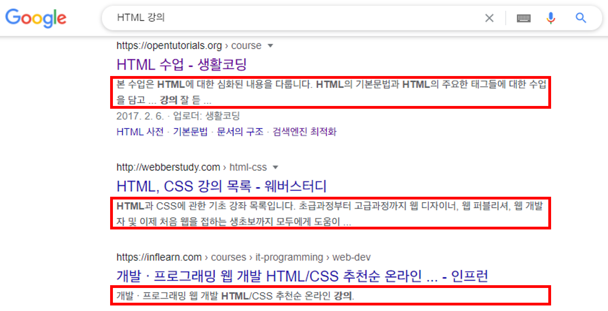
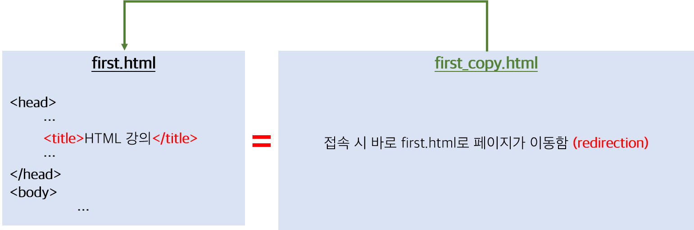
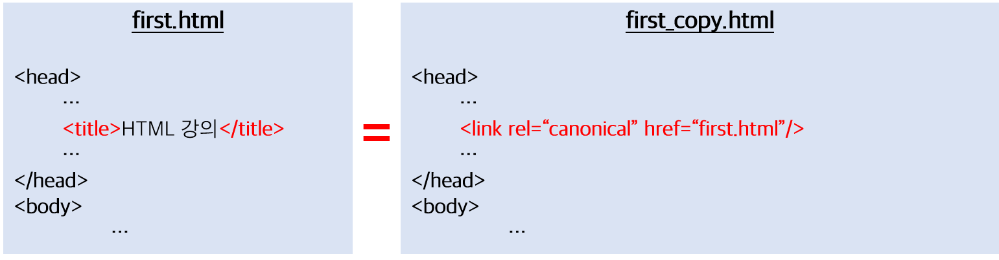
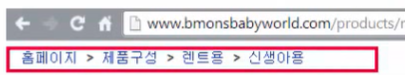
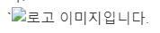

# HTML

HTML을 공부하며 모르는 것, 새로 배운 것들을 위주로 정리한 문서입니다.

## 생활코딩 - HTML

강의 링크
- [생활코딩-HTML](https://opentutorials.org/course/2039)

### HTML(HyperText Markup Language)

HTML은 3가지로 구성되어 있다.
1. Hypertext : 하이퍼텍스트를 가장 중요한 특징으로 한다.
   - 하이퍼텍스트란 문서와 문서가 링크로 연결되어있다는 것을 의미한다.
2. Markup : 마크업이라는 형식을 가진
   - Markup이 있다면 Markdown도 있는데, 현재 작성하고 있는 문서가 Markdown이다. 둘의 개념에 대해서는 나중에 다룰 예정이다.
3. Language : 컴퓨터 프로그래밍 언어이다.
   - 프로그래밍 언어는 사람과 컴퓨터가 소통하기 위한 수단을 정해놓은 규칙이다.

즉, 문서들끼리 연결되어 있다는 특성을 HTML 프로그래밍을 통해서 HTML 코드로 작성하는 것이다.

### HTML 역사

1. GML (1960년대 말) : Markup 언어들의 시조.
2. SGML : 현재 HTML에서 사용하는 꺽쇠 형태를 사용
3. SGMLguid : SGML이 발전된 형태. `팀 버너스 리`가 유럽 입자 물리연구소에서 일을 하며 비공식적으로 웹을 만듬. 17개의 태그가 존재함.
4. HTML : SGMLguid에서 `a태그`를 추가해서 만든 것. 웹의 발전에 있어서 `a태그`는 기존의 기술들과 구분되는 중요한 특성을 가지게 되었다.

조금 더 자세한 HTML 역사와 HTML 통계 결과는 아래의 링크에서 확인할 수 있다.

- [HTML 연대기](http://www.martinrinehart.com/frontend-engineering/engineers/html/html-tag-history.html) : HTML 1 버전부터 5 버전까지 HTML 태그의 역사에 대해 보여준다.
- [HTML 통계](https://www.advancedwebranking.com/html/) : 자주 쓰이는 태그와 속성들을 통계로 정리해놓은 사이트. 어떤 태그가 자주 쓰이고, 중요한지 파악할 수 있음.


### HTML 문법

#### `<a>`태그

a태그는 `anchor(닻)`의 맨 앞글자인 a를 의미한다. 즉, 특정 URL에 연결되어 있다는 것으로 해석할 수 있다.

`<a href="연결할 링크" target="_속성값" title="hover시 표시되는 문구">`

속성들의 순서는 전혀 상관없다. 

- target : 링크된 문서를 클릭했을 때, 문서가 열릴 위치를 명시해준다.
  |속성값|설명|
  |--|--|
  |_blank|링크된 문서를 새로운 윈도우나 탭에서 오픈함.|
  |_self(기본값)|링크된 문서를 링크가 위치한 현재 프레임에서 오픈함. 생략 가능. |
  |_parent|현재 프레임의 부모 프레임에서 오픈.|
  |_top|현재 윈도우 전체에서 오픈.|
  |프레임 이름|명시된 프레임에서 오픈. `<iframe>`과 함께 사용할 수 있지만, 최근에는 보안 문제로 사용하지 않는 것을 권장하고 있음.</iframe>|


#### `<p>` 태그

`Paragraph`의 맨 앞 글자인 p를 따서 만든 태그로, 단락을 의미한다. 블록 요소이기 때문에 다음 요소에 대해서는 자동으로 줄 바꿈이 수행되며, `<br>`태그가 2번 들어간 효과와 동일하다.

```HTML
<p>안녕하세요</p>
<p>반갑습니다</p>
<p>또 만나요</p>

<!-- 결과 -->
안녕하세요

반갑습니다

또 만나요
```

#### `<br>` 태그

`<br>`은 `A forced line-break`의 줄임말로, 1줄을 강제로 바꾸어버리는 태그이다. 위치에 상관없이 태그 내부, 태그 사이에서 모두 동일하게 적용할 수 있다. 태그를 연속해서 사용할 경우, 사용한 횟수만큼의 줄 간격이 벌어진다.

```HTML
<!-- 태그 사이에서 사용 -->
<a>foo</a><br>
<a>bar</a>

<!--결과-->
foo
bar

<!-- 태그 안에서 사용 -->
<a>foo<br>
bar
</a>

<!--결과-->
foo
bar

<!-- 여러 번 사용 -->
<a>foo</a><br><br><br><br>
<a>bar</a>

<!--결과-->
foo


bar
```
보통 하나의 단락을 표현할 때는 `<p>`태그를 사용하며, `<br>`을 이용한 단락 구분은 잘 사용하지 않는다.

만약 `<p>`태그의 단락 여백이 마음에 들지 않는다면, css의 `margin`이나 `padding` 속성값을 수정해서 조정할 수 있다.

##### [참고]
블록 요소는 `margin`, `padding`이 모두 작동하지만, 

인라인 요소는 `margin-left`, `margin-right`는 작동하지만, `margin-top`, `margin-bottom`은 작동하지 않는다. 


만약 인라인 요소에도 적용하고 싶다면, `display`속성을 `block`이나 `inline-block`으로 변경하면 된다.

#### `<form>`태그

`<form>`태그는 웹 페이지에서 사용자가 정보를 입력한 정보를 서버로 보낼 수 있는 기능을 수행한다.

``` HTML
<form action="http://localhost/login.php">
   <input type="text" name="id">
   <input type="password" name="pw">
   <input type="text" name="username">
   <input type="submit">
</form>
```

`<form>`태그의 속성으로 `action`은 입력한 정보들을 어떤 링크로 전송할 것인지 결정하는 역할을 한다.

그래서 위의 링크로 전송을 하면 다음과 같은 링크가 만들어진다.

`http://localhost/login.php?id=아이디&pw=1234&username=한준혁`

여기서 `&(앰퍼샌드)`는 각각의 `input`태그들이 가진 `name`속성에 따라 구분하는 기호이고, 입력된 데이터는 `name값=입력값`으로 전송된다. `name` 속성은 서버에서 각각의 `input`태그들을 구분하는 기준이 된다.

추후에 상세히 서술하겠지만, 위와 같이 URL에 정보를 담아 서버에 보내는 것을 `GET` 방식이라고 한다. 이렇게 정보를 보내면 보안에 민감한 개인정보가 주소에 노출된다는 단점이 있다. 

따라서 이를 `POST`방식으로 전송하게 되면, `GET`이 HTTP 패킷의 header에 보내는 것과 달리 정보가 패킷의 body에 담기게 된다. 각각의 방식마다 장단점이 있으므로 상황에 맞게 사용을 하면 된다. `GET`과 `POST`에 대한 자세한 개념은 추후에 작성할 예정이다.

##### `<select>` `<option>`태그

`<select>`와 `<option>`태그는 사용자가 값을 선택할 수 있도록 도와주는 태그이다.

``` HTML
<select name="color">
   <option value="red">빨강</option>
   <option value="blue">파랑</option>
   <option value="yellow">노랑</option>
</select>
```


콤보박스 형태로 만들어지며, `option`의 `value`속성은 태그 안에 적힌 텍스트 `빨강` 또는 `파랑`이 아닌 서버로 실제로 전달되는 값이다. 태그 사이에 적은 텍스트는 사용자에게 보여지는 텍스트이므로 잘 구분해서 사용해야 한다.

그리고 `<select>`에서 `multiple` 속성을 입력하면, 아래의 사진과 같이 여러 옵션을 선택할 수 있게 된다.

``` HTML
<select name="color" multiple>
   <option value="red">빨강</option>
   <option value="blue">파랑</option>
   <option value="yellow">노랑</option>
</select>
```


그러면 서버에서는 다음과 같이 2개의 옵션이 포함된 URL을 전달 받는다.

`http://localhost/select.php?color2=red&color2=blue`

##### `<input>`태그

`<input>`태그는 사용자의 값을 입력 받는 기능을 수행한다.

- `hidden` 속성 : UI상에는 보이지 않지만, 서버로 전송해야 하는 값이 있을 때 사용한다. 폼 제출 시 사용자가 변경해서는 안 되는 데이터를 보낼 때 사용한다. 
  - 예를 들어, 업데이트 되어야 하는 데이터베이스의 레코드를 저장하거나, 고유한 보안 토큰 등을 서버로 보낼 때 사용할 수 있다.
  - 또 다른 예시로, 이전 요청처리에 대한 값을 다음 요청에서도 연속성을 갖기 위해 사용하며, 이는 세션으로 대체할 수 있다.
  ``` HTML
  <form action="hide.php">
      <input type="text" name="id">
      <input type="hidden" name="hide" value="I'm hide">
      <input type="submit">
  </form>
  ```
  위와 같이 입력하면 URL은 다음과 같이 완성된다.
  `http://localhost/hide.php?id=?hide="I'm hide"`

- 파일 업로드 : 다음과 같이 작성하면 파일 업로드 할 수 있는 input 태그가 만들어진다.

   ```HTML

   <form action="http://localhost/upload.php" method="post" enctype="multipart/form-data">
      <input type="file" name="profile">
      <input type="submit">
   </form>
   ```

   이때, 반드시 `<form>`태그의 `method`는 `post`, `enctype`은 `multipart/form-data`로 설정해야 한다.
   
   그리고 `<input>`태그에는 `name`속성이 설정되어 있어야 서버에서 정상적으로 처리가 가능하다.

##### `<label>`태그

`<label>` 태그는 `<input>` 태그에 대한 설명을 붙여줄 때 사용하는데, `<label>`태그 안에 있는 텍스트를 클릭해도 `<input>` 태그에 마우스 포커싱이 옮겨지는 효과를 구현할 수 있어서 사용자의 편리성을 높일 수 있다.

```HTML
<form action="">
   <p>
      <label for="id_txt">ID : </label>
      <input id="id_txt" type="text" name="id">
   </p>
   <p>
      <label for="PW">PW : 
         <input id="PW" type="password" name="pwd">
      </label>
   </p>
   <p>
</form>
```
`<label>`과 `<input>`을 연결하기 위해서 전자에는 `for`속성값을, 후자에는 `id`속성값을 주면 된다.

만약 `<label>` 태그 안에 `<input>` 태그를 담는다면, 똑같은 효과를 내면서도 조금 더 간편하게 구현할 수 있다.

```HTML
<!-- label에 id 속성을 주지 않고도 똑같은 효과를 내는 방법 -->
<p>
   <label>
         <input type="checkbox" name="red"> 빨간색
   </label>
</p>
<p>
   <label>
         <input type="checkbox" name="blue">파란색
   </label>
</p>
```

#### GET과 POST 방식의 차이

`<form>` 태그에서 절대 빠질 수 없는 것이 GET과 POST 방식의 차이이다. 이에 대한 자세한 설명은 다른 문서에서 자세히 다루었다.

- [GET과 POST 방식](GET_POST.md)

### HTML 구조

``` HTML
<!DOCTYPE HTML> 
<!-- 브라우저에 HTML 문서가 어떤 표준에 맞추어 작성되었는지 알려주는 역할을 한다. ex)XHTML1.0 
 HTML5에서는 DOCTYPE HTML로 통합되었다.  -->
<html> : HTML 문서 전체를 감싸는 역할을 한다.
<head>
   <!-- 본문을 꾸미거나, HTML에 대한 부가정보를 포함한다. -->
   <title>웹 브라우저에서 표시될 제목</title>
   <meta charset="utf-8"> // 본문의 인코딩을 utf-8로 지정한다.
</head>
<body>
   HTML 본문에 해당하는 내용이 들어간다.
</body>
</html>
```

### Meta Data(메타 데이터)

`Meta Data`는 데이터에 대한 데이터이다. 즉, **다른 데이터를 설명**하기 위해서 사용되는 데이터이다.

HTML는 다양한 정보를 담은 정보인데, 해당 HTML 문서에 대해 부가적인 정보를 표현하기 위해 `<meta>`태그를 사용한다. HTML이라는 정보를 조금 더 가치 있는 정보로 만들기 위해서 사용한다고 이해할 수 있다.

``` HTML
<html>
   <head>
      <meta charset="utf-8">
      <meta name="description" content="Hello HTML!">
      <meta name="keywords" content="코딩, coding, 프로그래밍, html, css, js">
      <meta name="author" content="joon">
      <meta http-equiv="refresh" content="30">
   </head>
   <body>
      안녕하세요. HTML에 대해서 정리한 문서입니다.
   </body>
</html>
```
위에서 사용된 속성들에 대해서 하나씩 설명하자면 다음과 같다.

- `charset` : HTML 문서의 인코딩 형식을 나타내는 속성. 해당 속성이 존재하지 않으면 브라우저가 마음대로 해석을 하기 때문에, 글자가 깨져서 보인다.
- `name="description"` : 해당 문서에 대한 요약이다. 우리 눈에는 보이지 않지만, 검색엔진에서 검색했을 때 요약 정보로 표시될 수 있다.
- `name="keywords"` : 해당 문서에 대한 키워드 목록이다. 마찬가지로 검색엔진 최적화에 사용될 수 있다.
- `name="author"` : 해당 문서의 저자를 의미한다.
- `http-equiv="refresh"` : 자주 사용하지는 않지만, `content`에 설정한 초를 주기로 새로고침이 실행된다.


### 의미론적 태그(Semantic Tag)

시맨틱 태그(Semantic tag)는 HTML 문서를 의미 단위로 구분하기 쉽게 사용하는 태그이다. HTML5부터 본격적으로 사용되기 시작했다. 기존에는 `div` 태그를 이용해 개발자가 임의대로 나눠서 HTML 구조를 한 번에 이해하기 어려웠는데, 시맨틱 태그는 이러한 한계를 극복하기 위해서 등장하였다. 

<p align="center">
   
   출처 : <a href="https://thrillfighter.tistory.com/492">https://thrillfighter.tistory.com/492</a>
</p>

현대의 웹 페이지는 위와 같은 구조를 띄고 있다. 
시맨틱 태그가 `div` 태그와 다른 기능을 수행하는 것은 아니고, HTML 구조를 한 눈에 알아보기 쉽게 사용하는 태그이다. 
시맨틱 태그를 하나씩 살펴보면 다음과 같다.

- `header` : 페이지의 상단에 보이는 영역이다. 주로 머리말이나 제목을 표현하기 위해 사용한다.
- `nav` : 네비게이션이라고 불리며, 같은 사이트 내의 링크나 다른 사이트로의 링크들을 모아놓은 태그이다. 
- `section` : 본문의 의미를 가지고 있으며, 여러 article을 모아놓은 태그이다. 본문의 갯수에 따라 여러 section을 가질 수 있다. 
- `aside` : 페이지 좌측 또는 우측에서 페이지 콘텐츠를 제외한 내용을 표시하는 태그이다. 주로 광고나 사이드 바가 위치한다.
- `footer` : 페이지 하단에 위치하는 태그이다. 주로 저작권, 연락처 정보와 같은 내용이 삽입된다. 

이 외에도 다양한 시맨틱 태그가 사용되고 있는데, 크롬의 `개발자 도구`를 이용해서 다양한 웹 페이지를 둘러보면 시맨틱 태그가 어떻게 사용되는지 감이 올 것이다. 무엇보다 가장 좋은 방법은 **직접 페이지를 제작**해보는 것이다. 😊

### 검색엔진 최적화(SEO; Search Engine Optimization)

`검색 엔진 최적화`란 웹 페이지 검색 엔진이 자료를 수집하고 순위를 매기는 방식에 맞게 웹 페이지를 구성해서 검색 결과의 상위에 나올 수 있도록 하는 작업이다.

구글이나 네이버와 같은 회사에서 제공하는 `검색 엔진`은 사용자가 검색한 내용에 적합한 웹 사이트를 보여준다. 검색 엔진 회사들은 각각의 웹 페이지마다 페이지를 해석하고 분석하는 `로봇`을 보내는데, 정해진 기준에 맞추어 분류를 하고, 사용자가 검색했을 때 가장 적합한 콘텐츠를 보여준다.

#### 링크 최적화

##### 1. `<title>` 태그의 정보
- 책이나 신문과 비슷하게 가장 먼저 정보를 흡수할 수 있는 것은 제목이다. 마찬가지로 페이지에도 제목을 명확하게 표시해주어야 한다.
- 예를 들어, `HTML 강의`라는 정보가 A페이지에는 웹 페이지의 제목인 `<title>` 태그에 있고, B페이지에는 본문의 `<li>` 태그에 포함되어 있다고 해보자. 이때, 검색엔진이 가장 먼저 결과를 보여주는 우선순위는 `<title>`이라는 것이다.
.png)
##### 2. meta 태그의 `description` 속성
-  페이지에 부가정보 담을 수 있는 `<meta>`태그에 `description` 속성을 이용해서 페이지에 대한 요약 정보를 잘 나타낼 수록 상위 검색 결과로 노출된다. 

- 위의 사진처럼 구글에서 검색을 했을 때, 페이지 링크 밑에 간단하게 보여주는 정보이다. 따라서 사용자의 직관적인 이해를 돕기 위해서는 1~2줄이나 짧은 단락으로 구성하는 것이 좋다.
##### 3. 페이지의 URL 구조
- 콘텐츠의 내용을 잘 보여주는 URL로 구성을 한다.
 Ex) 고양이가 좋아하는 간식에 대해 쓴 블로그 게시물에는 `http://blog.naver.com/a3242dcm.html`보다 `http://blog.naver.com/cats-like-these-foods.html`과 같은 URL이 좋다.

- 가급적이면 디렉토리가 단순한 URL을 구성한다.
 EX) `http://localhost:8080/blog/page/function/post/30.html`처럼 깊은 하위 디렉토리를 사용하는 것이 아닌 `http://localhost:8080/post/30.html` 얕은 디렉토리를 사용한 URL을 사용한다.
##### 4. 특정 문서에 도달하기 위한 한 가지 형태의 URL 제공
- 같은 내용의 페이지가 2개 있다고 하면, URL을 `리디렉션(redirection)`하여 1개의 페이지에서 접속할 수 있도록 설정한다.

- 만약 `redirection`을 사용할 수 없다면, `<link>` 태그에 `rel="canonical"` 속성을 사용함으로써 두 페이지 모두 같은 내용이라는 것을 암시해줄 수 있다.
EX) `<link rel="canonical" href="http://localhost:8080/first.html">`

##### 5. 사이트 내에서 이동하기 쉽게 만들기
- 크롤링을 하는 로봇들은 사이트 내의 페이지끼리 링크로 잘 연결되어있다면 정보를 쉽게 가져갈 수 있게 된다.
##### 6. 홈페이지를 기반으로 한 이동 경로 계획
- 모든 사이트는 접속하면 가장 먼저 보이는 대문 페이지(홈페이지)가 존재한다. 주로 `index.html`이 홈페이지가 되는데, 이는 사용자가 가장 많이 방문하는 페이지이며, 탐색을 시작하는 위치이다. 따라서 사용자가 첫 페이지에서 더 구체적인 콘텐츠가 있는 페이지로 이동하는 방법에 대해서 생각해야 한다. 
##### 7. '사이트 이동 경로의 사용'으로 방문자에게 편리 제공하기

- 현재 접속한 페이지가 어느 위치인지 표시해주는 네비게이션을 이용한다.

##### 8. 사용자가 URL의 일부를 제거하는 상황을 고려
- 사용자들 중 URL의 일부를 삭제해서 개발자가 의도하지 않은 페이지를 탐색하는 경우를 대비해야 한다.
- 예를 들어, `http://opentutorial.org/course/2039`를 `http://opentutorial.org/admin`으로 접속하면 일반 사용자들이 관리자 페이지로 접속할 수도 있게 된다.
- 따라서 사용자가 임의의 페이지를 탐색할 수 없도록 `404 Error`를 표시해주거나, 상위 디렉토리 `http://opentutorial.org`로 이동시키는 방법이 있다. 

##### 9. 자연스러운 계층 구조 만들기
- 사용자가 일반적인 내용에서 구체적인 내용으로 쉽게 이동할 수 있도록 사이트를 구성한다. 

##### 10. 이동 경로를 위해 텍스트 링크를 사용
- 보통은 링크를 연결하기 위해서 `<a>`태그를 사용하지만, `javascript`를 사용하면 콤보박스나 다른 태그 요소에서도 링크를 연결할 수 있다.
   ``` HTML
   <select onchange="location.href=this.value">
      <option value="sign_up.html">회원가입</option>
      <option value="pw_find.html">비밀번호 찾기</option>
   </select>
   ```

#### 콘텐츠 최적화

1. 보다 나은 앵커 텍스트 작성
- `<a>`태그를 이용해서 페이지를 연결할 때, 텍스트의 내용을 사용자와 검색 엔진 로봇이 이해하기 쉽도록 작성하는 것이 좋다는 것이다.
  >`<a href="http://naver.com">http://naver.com</a>`처럼 텍스트를 링크로 작성하는 것이 아닌 `<a href="http://naver.com">네이버</a>`로 작성한다.
- `여기를 클릭`, `페이지`, `문서`와 같은 텍스트는 사람이 봤을 때는 직관적으로 이해할 수 있어도 로봇은 이해하기 어렵고, 정보로서의 가치도 현저히 낮아지기 때문에 이러한 텍스트는 `지양`해야 한다.

2. 링크를 눈에 띄기 쉽게 포맷하기 
- CSS를 활용해서 일반 텍스트와 링크의 앵커 텍스트를 쉽게 구분하게 한다. 이는 사용자가 링크를 놓치거나 실수로 클릭하는 경우를 방지하기 위함이다.

3. 제목 태그를 활용해서 중요한 부분 강조하기
- `<h1>`부터 `<h6>`까지 제목을 강조하기 위한 태그를 적절히 사용해서 시각적으로 중요한 인식을 주고, 가독성을 높여주어 상세 콘텐츠를 이해하는 데 도움을 준다. 
   ``` HTML
   <h1>자기소개</h1>
   <h2>이름</h2>
   <span>홍길동</span>
   <h2>소속</h2>
   <span>지구별</span>
   ...
   ```

#### 이미지 사용의 최적화

1. `alt` 속성 사용
- 이미지가 깨졌을 때 대체해서 보여줄 텍스트를 설정하는 `alt`속성은 시각장애인 분들처럼 스크린뷰를 사용할 때에도 유용한 정보를 제공해줄 수 있다.

   ``
   

2. 이미지를 위한 디렉토리 설정
- `src`속성으로 작성하는 이미지의 경로에는 이미지 파일만을 위한 디렉토리를 이용하는 것이 좋다.
   ``

3. 간결하고 설명적인 파일 이름 사용
- 임의로 지정한 파일 이름이 아닌 이미지에 대한 정보를 담고 있는 파일 이름을 작성한다.
- 예를 들어, 로고 이미지 파일은 `123.png` 보다 `logo.png`라고 저장하는 것이 훨씬 직관적이다.

4. 이미지를 링크로 사용할 때, `alt` 속성 사용하기
   ``` HTML
   <a href="1.html">
      
   </a>
   ```
